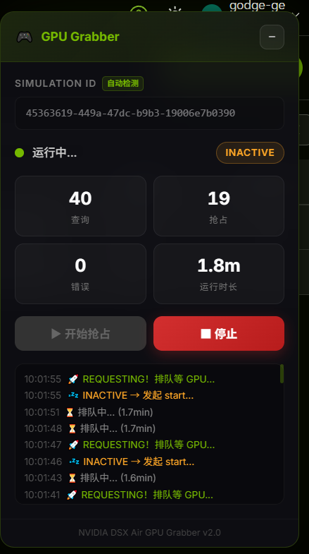

# 🎮 NVIDIA DSX Air GPU Grabber & Keepalive

> 自动抢占 NVIDIA DSX Air 平台 GPU 模拟实例的油猴脚本 + API 自动保活脚本。

## ✨ 功能特性



- 🔄 **自动轮询抢占** — 高频检测 GPU 状态，空闲瞬间自动启动
- 🎨 **毛玻璃 UI 面板** — 深色半透明 + NVIDIA 绿色主题，支持拖拽 & 最小化
- ⚙️ **Simulation ID 可配置** — 支持手动输入、URL 自动检测、跨会话持久化存储
- 📊 **实时统计看板** — 查询次数、抢占次数、错误次数、运行时长
- 📜 **活动日志** — 彩色高亮滚动日志，最多 80 条记录
- 🔔 **多重通知** — 抢到后播放提示音 + 浏览器弹窗通知
- ⏹️ **一键停止** — 随时停止/重启抢占
- 💓 **API 自动保活** — 定时续期 `sleep_at`，防止实例被强制休眠

## 📦 文件说明

| 文件 | 说明 |
|---|---|
| `nvidia-gpu-grabber.user.js` | 油猴脚本 — 浏览器端自动抢占（推荐） |
| `keep_live.sh` | 保活脚本 — 通过 API 自动续期，防止实例休眠 |
| `main.js` | 原始控制台注入版本（无 UI） |

## 🚀 安装使用

### 前置条件

- Chrome / Edge / Firefox 浏览器
- 已安装 [Tampermonkey](https://www.tampermonkey.net/) 扩展

### 安装步骤

1. 打开 Tampermonkey 管理面板 → **添加新脚本**
2. 清空默认内容，粘贴 `nvidia-gpu-grabber.user.js` 的全部代码
3. `Ctrl + S` 保存脚本

### 使用方法

1. 登录 [NVIDIA DSX Air](https://dsx-air.nvidia.com) 平台
2. 进入目标 Simulation 页面，右上角自动出现控制面板
3. 确认 **Simulation ID** 已自动填入（或手动输入）
4. 点击 **▶ 开始抢占**，脚本开始自动轮询
5. 抢到 GPU 后自动停止并发出提示音通知

## 🖥️ 面板功能说明

```
┌─────────────────────────────┐
│ 🎮 GPU Grabber          [−] │  ← 拖拽移动 / 最小化
├─────────────────────────────┤
│ Simulation ID  [自动检测]    │
│ ┌───────────────────────┐   │
│ │ xxxxxxxx-xxxx-xxxx... │   │  ← 可编辑输入框
│ └───────────────────────┘   │
│ ● 运行中...      REQUESTING │  ← 状态指示
│ ┌──────┐ ┌──────┐          │
│ │  42  │ │   3  │          │
│ │ 查询  │ │ 抢占  │          │  ← 实时统计
│ ├──────┤ ├──────┤          │
│ │   0  │ │ 2.5m │          │
│ │ 错误  │ │时长   │          │
│ └──────┘ └──────┘          │
│ [▶ 开始抢占] [■ 停止]       │  ← 控制按钮
│ ┌───────────────────────┐   │
│ │ 10:30:15 ⏳ 排队中...  │   │
│ │ 10:30:12 🚀 REQUESTING│   │  ← 活动日志
│ │ 10:30:11 💤 INACTIVE   │   │
│ └───────────────────────┘   │
├─────────────────────────────┤
│   NVIDIA DSX Air v2.0       │
└─────────────────────────────┘
```

## ⚙️ 轮询策略

| 状态 | 行为 | 间隔 |
|---|---|---|
| `INACTIVE` | 立即调用 start API 抢占 | 1 秒 |
| `REQUESTING` | 等待 GPU 分配 | 3 秒 |
| `ACTIVE` | 🎉 成功！停止脚本 | — |
| 未知状态 | 等待后重试 | 5 秒 |
| 请求异常 | 记录错误后重试 | 5 秒 |

## 🔧 自定义配置

### 修改 Simulation ID

支持三种方式：

1. **自动检测** — 访问 `/simulations/{uuid}` 页面时自动提取
2. **手动输入** — 在面板输入框中直接填写 UUID
3. **持久化** — 输入的 ID 通过 `GM_setValue` 保存，下次自动加载

### 修改轮询间隔

在脚本中搜索 `await sleep(...)` 调整对应状态的轮询间隔（单位：毫秒）。

## 💓 自动保活（keep_live.sh）

免费用户的 Simulation 实例默认最多保持 **3 天**活跃后会被强制休眠。`keep_live.sh` 通过 API 定时将 `sleep_at` 往后延 71 小时，实现自动续期保活。

> ⚠️ **关于 3 天限制**：之前确认是 3 天自动休眠，但近期手动延长时未被拒绝，此限制可能已调整，存疑。

### 获取 API Key

1. 访问 [NVIDIA NGC API Keys](https://org.ngc.nvidia.com/account/api-keys)
2. 点击 **Generate API Key**
3. 选择所需权限，创建并 **妥善保存** Key（仅显示一次）

### 配置

编辑 `keep_live.sh`，填入你的凭据：

```bash
NVIDIA_AIR_API_KEY="你的API Key"
SIMULATION_ID="你的Simulation UUID"
```

### 手动运行

```bash
chmod +x keep_live.sh
./keep_live.sh
```

输出示例：
```
target_sleep_at=2026-05-24T06:00:00Z
before_sleep_at=2026-05-22T11:00:00Z
after_sleep_at=2026-05-24T06:00:00Z
ok
```

### 定时自动保活（Cron）

建议每 **6 小时**执行一次，确保稳定续期：

```bash
crontab -e
```

添加：

```cron
0 */6 * * * /path/to/keep_live.sh >> /var/log/nvidia-keepalive.log 2>&1
```

### 工作原理

```
当前时间 ──► +71小时 ──► 设置为新的 sleep_at
                              │
                    PATCH /api/v3/simulations/{id}/
                              │
                    验证返回的 sleep_at 是否匹配
```

## ⚠️ 注意事项

- **抢占脚本**依赖浏览器已登录的 Cookie 进行认证，请确保 **已登录** DSX Air 平台
- 长时间运行抢占脚本请保持浏览器标签页 **前台活跃**，避免被浏览器节流
- **保活脚本**需要 API Key，请勿将 Key 提交到公开仓库
- 请合理使用，避免过于频繁的请求对平台造成负担

## 📄 License

MIT
